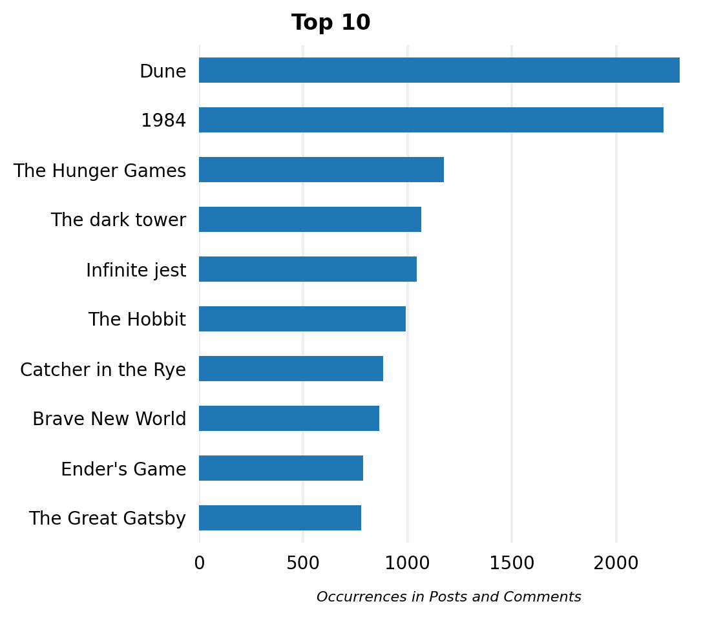
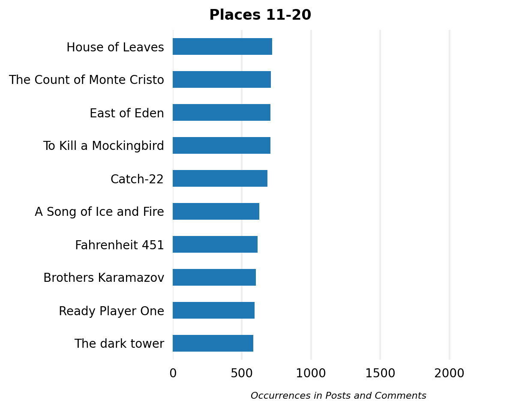

# r/books Book Ranking

I analyzed how often book titles occur in the subreddit [r/books](https://reddit.com/r/books).
The ranking is based on all posts posted before 2022-09-31 (546,219 posts of which 289,581 posts were already removed or deleted).

## Results

Click to view the top 100 most often occurred books

|     | Title                                |   Occurrences |
|----:|:-------------------------------------|--------------:|
|   1 | Dune                                 |          2306 |
|   2 | 1984                                 |          2229 |
|   3 | The Hunger Games                     |          1176 |
|   4 | Infinite jest                        |          1045 |
|   5 | The Hobbit                           |           999 |
|   6 | Catcher in the Rye                   |           882 |
|   7 | Brave New World                      |           866 |
|   8 | Ender's Game                         |           788 |
|   9 | The Great Gatsby                     |           778 |
|  10 | Crime and Punishment                 |           742 |
|  11 | House of Leaves                      |           719 |
|  12 | The Count of Monte Cristo            |           709 |
|  13 | To Kill a Mockingbird                |           708 |
|  14 | East of Eden                         |           708 |
|  15 | Catch-22                             |           684 |
|  16 | A Song of Ice and Fire               |           626 |
|  17 | Fahrenheit 451                       |           613 |
|  18 | Brothers Karamazov                   |           602 |
|  19 | Ready Player One                     |           591 |
|  20 | The dark tower                       |           584 |
|  21 | The hitchhiker's guide to the galaxy |           546 |
|  22 | Animal Farm                          |           538 |
|  23 | Pride and Prejudice                  |           523 |
|  24 | American Gods                        |           522 |
|  25 | Slaughterhouse-Five                  |           500 |
|  26 | The Odyssey                          |           495 |
|  27 | American Psycho                      |           490 |
|  28 | Dark Towers                          |           483 |
|  29 | The Name of the Wind                 |           459 |
|  30 | Atlas Shrugged                       |           454 |
|  31 | Misery                               |           447 |
|  32 | A Little Life                        |           438 |
|  33 | The Alchemist                        |           428 |
|  34 | The Handmaid's Tale                  |           416 |
|  35 | The Witcher                          |           403 |
|  36 | 11/22/63                             |           403 |
|  37 | Gravity's Rainbow                    |           389 |
|  38 | Fight club                           |           388 |
|  39 | 50 Shades of Grey                    |           387 |
|  40 | Lord of the Flies                    |           377 |
|  41 | The magician                         |           366 |
|  42 | The Grapes of Wrath                  |           356 |
|  43 | Neuromancer                          |           350 |
|  44 | Kafka on the Shore                   |           347 |
|  45 | Wuthering Heights                    |           337 |
|  46 | Flowers for Algernon                 |           336 |
|  47 | Gone Girl                            |           336 |
|  48 | The secret history                   |           335 |
|  49 | 1Q84                                 |           333 |
|  50 | Gunslinger                           |           329 |
|  51 | A Clockwork Orange                   |           324 |
|  52 | Of Mice and Men                      |           321 |
|  53 | Norwegian wood                       |           319 |
|  54 | Cat's Cradle                         |           312 |
|  55 | Jurassic Park                        |           308 |
|  56 | Captivate                            |           307 |
|  57 | Divergent                            |           298 |
|  58 | One Hundred Years of Solitude        |           296 |
|  59 | The inferno                          |           290 |
|  60 | The Stormlight Archive               |           287 |
|  61 | His Dark Materials                   |           280 |
|  62 | Cloud Atlas                          |           279 |
|  63 | Flashback                            |           278 |
|  64 | Les Misérables                       |           276 |
|  65 | The Way of Kings                     |           265 |
|  66 | The Book Thief                       |           262 |
|  67 | World War Z                          |           258 |
|  68 | The old man and the sea              |           253 |
|  69 | Project Hail Mary                    |           247 |
|  70 | Kite Runner                          |           246 |
|  71 | The Picture of Dorian Gray           |           245 |
|  72 | Heart of Darkness                    |           243 |
|  73 | Red Rising                           |           242 |
|  74 | The Goldfinch                        |           237 |
|  75 | Salem's Lot                          |           236 |
|  76 | Never let me go                      |           234 |
|  77 | The Silmarillion                     |           232 |
|  78 | The Song of Achilles                 |           230 |
|  79 | The Fountainhead                     |           226 |
|  80 | Snow Crash                           |           222 |
|  81 | And Then There Were None             |           221 |
|  82 | Do Androids Dream of Electric Sheep? |           219 |
|  83 | Normal People                        |           215 |
|  84 | Good Omens                           |           215 |
|  85 | The Bell Jar                         |           214 |
|  86 | The Fault in Our Stars               |           209 |
|  87 | Wind-Up Bird Chronicle               |           208 |
|  88 | Watership Down                       |           205 |
|  89 | Girl With the Dragon Tattoo          |           204 |
|  90 | Little Women                         |           204 |
|  91 | The Maze Runner                      |           203 |
|  92 | The Divine Comedy                    |           202 |
|  93 | The Little Prince                    |           199 |
|  94 | The Godfather                        |           199 |
|  95 | The Human Condition                  |           195 |
|  96 | A Tale of Two Cities                 |           191 |
|  97 | The Sound and the Fury               |           189 |
|  98 | For Whom the Bell Tolls              |           188 |
|  99 | The haunting of Hill House           |           188 |
| 100 | A Farewell to Arms                   |           187 |

## How It Works
### Stage 1 - Prepare Books

[Stage_1-BooksPreparation.ipynb](Stage_1-BooksPreparation.ipynb)

Analyze the book dump from OpenLibrary and remove all duplicates and ambivalent book titles.

### Stage 2 - Find the IDs of all Posts that were posted in the Subreddit

[Stage_2-ScrapeAllPostIDs.ipynb](Stage_2-ScrapeAllPostIDs.ipynb)

Download the ID of every post that was posted in the subreddit via the PRAW API.

### Stage 3 - Download all Posts

[Stage_3-DownloadAndPreparePosts.ipynb](Stage_3-DownloadAndPreparePosts.ipynb)

Use the previously collected IDs to download the post texts. All posts marked as deleted or removed are discarded.

### Stage 4 - Count how often the Book Titles occur in the Posts

[Stage_4-CountBookTitlesInPosts.ipynb](Stage_4-CountBookTitlesInPosts.ipynb)

Generate a regular expression from the book titles and count the largest non-overlapping occurrences for each book title.

### Stage 5 - Clean the resulting Book Counts

[Stage_5-CleanUpBookRanking.ipynb](Stage_5-CleanUpBookRanking.ipynb)

There are many book titles that cannot be uniquely identified as book titles (e.g. 'It' by Stephen King) that have to be removed.

The final book ranking is based on the cleaned ranking.

### Stage 6 - Generate Graphics

[Stage_6-CreateGraphics.ipynb](Stage_6-CreateGraphics.ipynb)

Use the collected data to generate a few plots.
