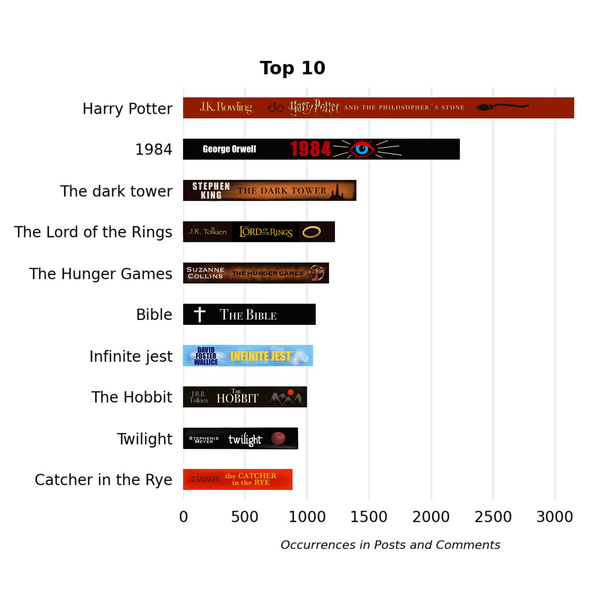

# r/books Book Ranking

I analyzed how often book titles occur in the subreddit [r/books](https://reddit.com/r/books).
The ranking is based on all posts posted before 2022-09-31 (546,219 posts of which 289,581 posts were already removed or deleted).

## Results

Click to view the top 100 most often occurred books

|     | Title                                |   Occurrences |
|----:|:-------------------------------------|--------------:|
|   1 | Dune                                 |          2303 |
|   2 | 1984                                 |          2228 |
|   3 | The Hunger Games                     |          1173 |
|   4 | The dark tower                       |          1064 |
|   5 | Infinite jest                        |          1045 |
|   6 | The Hobbit                           |           992 |
|   7 | Catcher in the Rye                   |           882 |
|   8 | Brave New World                      |           864 |
|   9 | Ender's Game                         |           787 |
|  10 | The Great Gatsby                     |           777 |
|  11 | Crime and Punishment                 |           741 |
|  12 | House of Leaves                      |           719 |
|  13 | East of Eden                         |           708 |
|  14 | To Kill a Mockingbird                |           708 |
|  15 | The Count of Monte Cristo            |           705 |
|  16 | Catch-22                             |           681 |
|  17 | A Song of Ice and Fire               |           624 |
|  18 | Fahrenheit 451                       |           606 |
|  19 | Brothers Karamazov                   |           601 |
|  20 | Ready Player One                     |           591 |
|  21 | The hitchhiker's guide to the galaxy |           546 |
|  22 | Animal Farm                          |           538 |
|  23 | American Gods                        |           520 |
|  24 | Pride and Prejudice                  |           520 |
|  25 | Slaughterhouse-Five                  |           499 |
|  26 | The Odyssey                          |           494 |
|  27 | American Psycho                      |           489 |
|  28 | The Name of the Wind                 |           458 |
|  29 | Atlas Shrugged                       |           451 |
|  30 | Misery                               |           447 |
|  31 | A Little Life                        |           438 |
|  32 | The Alchemist                        |           424 |
|  33 | The Handmaid's Tale                  |           415 |
|  34 | The Witcher                          |           401 |
|  35 | 11/22/63                             |           400 |
|  36 | Gravity's Rainbow                    |           389 |
|  37 | 50 Shades of Grey                    |           387 |
|  38 | Fight club                           |           386 |
|  39 | Lord of the Flies                    |           377 |
|  40 | The Grapes of Wrath                  |           356 |
|  41 | Neuromancer                          |           350 |
|  42 | Kafka on the Shore                   |           346 |
|  43 | Wuthering Heights                    |           335 |
|  44 | The secret history                   |           335 |
|  45 | Gone Girl                            |           335 |
|  46 | Flowers for Algernon                 |           334 |
|  47 | 1Q84                                 |           332 |
|  48 | Gunslinger                           |           329 |
|  49 | A Clockwork Orange                   |           324 |
|  50 | Of Mice and Men                      |           320 |
|  51 | Norwegian wood                       |           318 |
|  52 | Cat's Cradle                         |           312 |
|  53 | Jurassic Park                        |           305 |
|  54 | Divergent                            |           298 |
|  55 | One Hundred Years of Solitude        |           294 |
|  56 | The inferno                          |           290 |
|  57 | The Stormlight Archive               |           287 |
|  58 | His Dark Materials                   |           280 |
|  59 | Cloud Atlas                          |           278 |
|  60 | Les Misérables                       |           276 |
|  61 | The Way of Kings                     |           264 |
|  62 | The Book Thief                       |           261 |
|  63 | World War Z                          |           259 |
|  64 | The old man and the sea              |           253 |
|  65 | The Picture of Dorian Gray           |           245 |
|  66 | Kite Runner                          |           244 |
|  67 | Heart of Darkness                    |           243 |
|  68 | Project Hail Mary                    |           241 |
|  69 | Red Rising                           |           240 |
|  70 | Salem's Lot                          |           236 |
|  71 | The Goldfinch                        |           236 |
|  72 | Never let me go                      |           234 |
|  73 | The Silmarillion                     |           230 |
|  74 | The Song of Achilles                 |           229 |
|  75 | The Fountainhead                     |           226 |
|  76 | Snow Crash                           |           222 |
|  77 | And Then There Were None             |           221 |
|  78 | Do Androids Dream of Electric Sheep? |           218 |
|  79 | Good Omens                           |           215 |
|  80 | Normal People                        |           213 |
|  81 | The Bell Jar                         |           210 |
|  82 | The Fault in Our Stars               |           209 |
|  83 | Wind-Up Bird Chronicle               |           207 |
|  84 | Watership Down                       |           205 |
|  85 | Girl With the Dragon Tattoo          |           204 |
|  86 | Little Women                         |           204 |
|  87 | The Maze Runner                      |           203 |
|  88 | The Divine Comedy                    |           202 |
|  89 | The Little Prince                    |           199 |
|  90 | The Godfather                        |           199 |
|  91 | The Human Condition                  |           194 |
|  92 | A Tale of Two Cities                 |           191 |
|  93 | The Sound and the Fury               |           189 |
|  94 | Watchmen                             |           187 |
|  95 | A Farewell to Arms                   |           187 |
|  96 | The haunting of Hill House           |           186 |
|  97 | For Whom the Bell Tolls              |           186 |
|  98 | Finnegans wake                       |           186 |
|  99 | The Pillars of the Earth             |           184 |
| 100 | The Perks of Being a Wallflower      |           182 |

## How It Works
### Stage 1 - Prepare Books

[Stage_1-BooksPreparation.ipynb](Stage_1-BooksPreparation.ipynb)

Analyze the book dump from OpenLibrary and remove all duplicates and ambivalent book titles.

### Stage 2 - Find the IDs of all Posts that were posted in the Subreddit

[Stage_2-ScrapeAllPostIDs.ipynb](Stage_2-ScrapeAllPostIDs.ipynb)

Download the ID of every post that was posted in the subreddit via the PRAW API.

### Stage 3 - Download all Posts

[Stage_3-DownloadAndPreparePosts.ipynb](Stage_3-DownloadAndPreparePosts.ipynb)

Use the previously collected IDs to download the post texts. All posts marked as deleted or removed are discarded.

### Stage 4 - Count how often the Book Titles occur in the Posts

[Stage_4-CountBookTitlesInPosts.ipynb](Stage_4-CountBookTitlesInPosts.ipynb)

Generate a regular expression from the book titles and count the largest non-overlapping occurrences for each book title.

### Stage 5 - Clean the resulting Book Counts

[Stage_5-CleanUpBookRanking.ipynb](Stage_5-CleanUpBookRanking.ipynb)

There are many book titles that cannot be uniquely identified as book titles (e.g. 'It' by Stephen King) that have to be removed.

The final book ranking is based on the cleaned ranking.

### Stage 6 - Generate Graphics

[Stage_6-CreateGraphics.ipynb](Stage_6-CreateGraphics.ipynb)

Use the collected data to generate a few plots and automatically update the ranking in this README.md.
